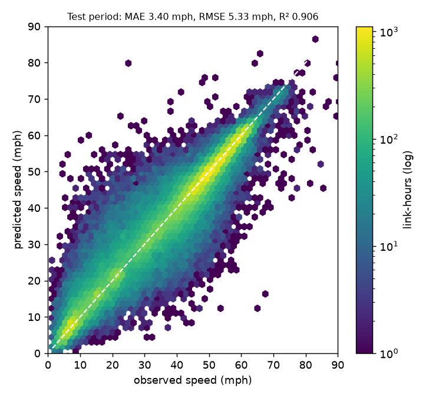
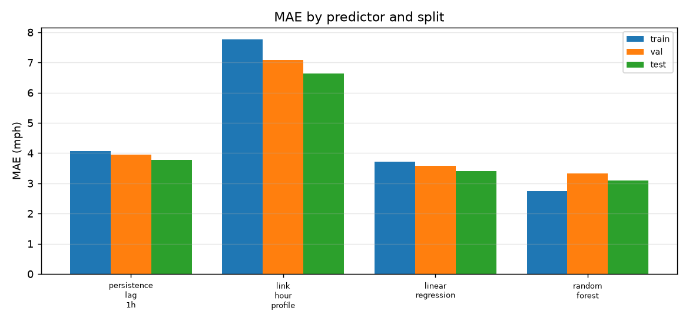
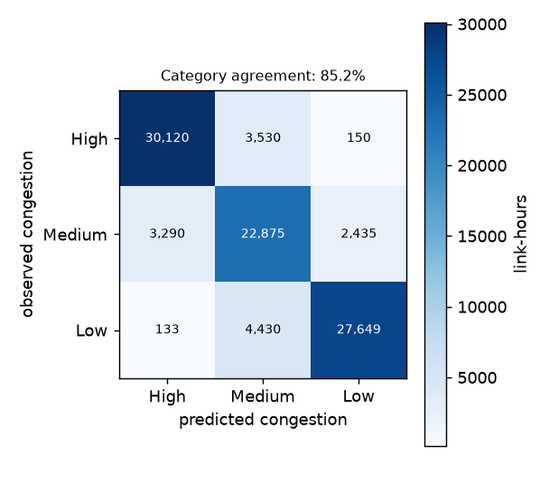
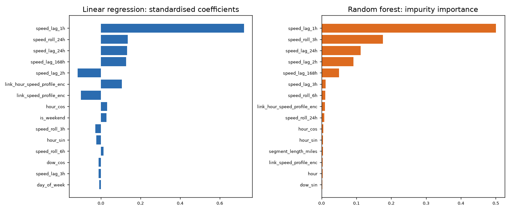
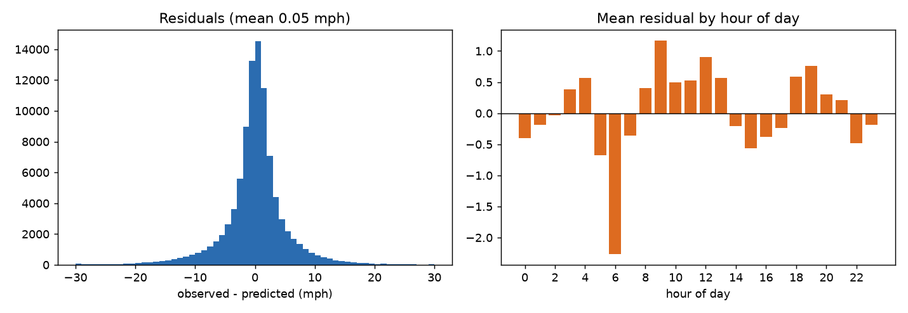
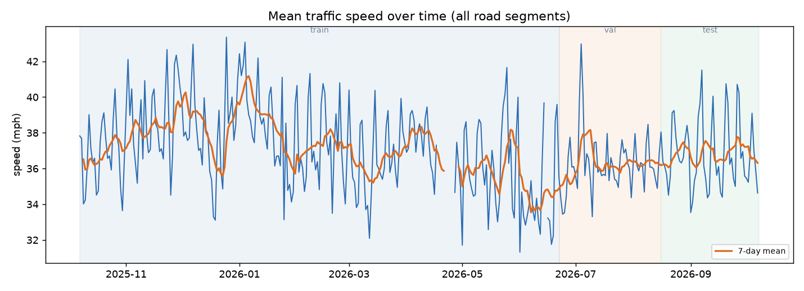
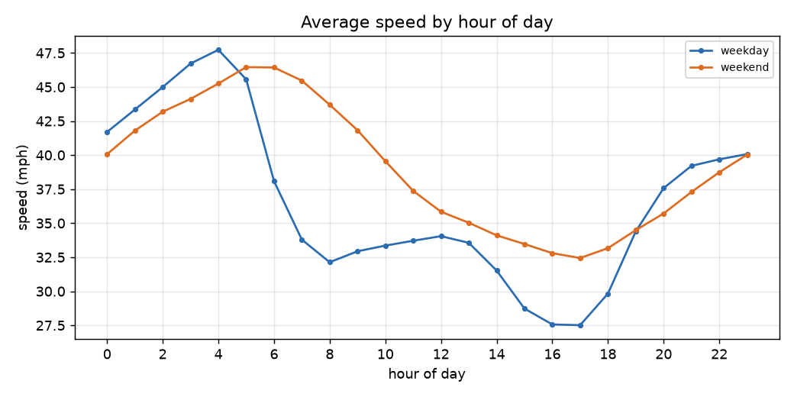
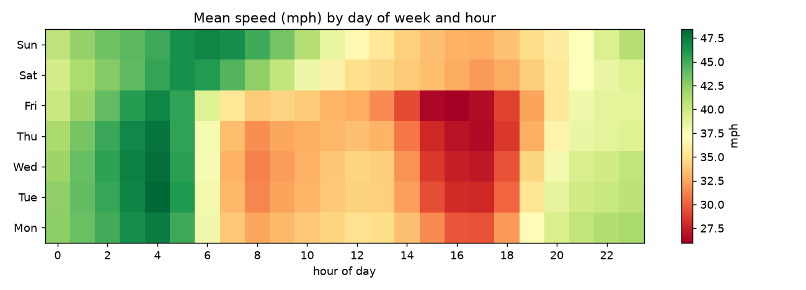
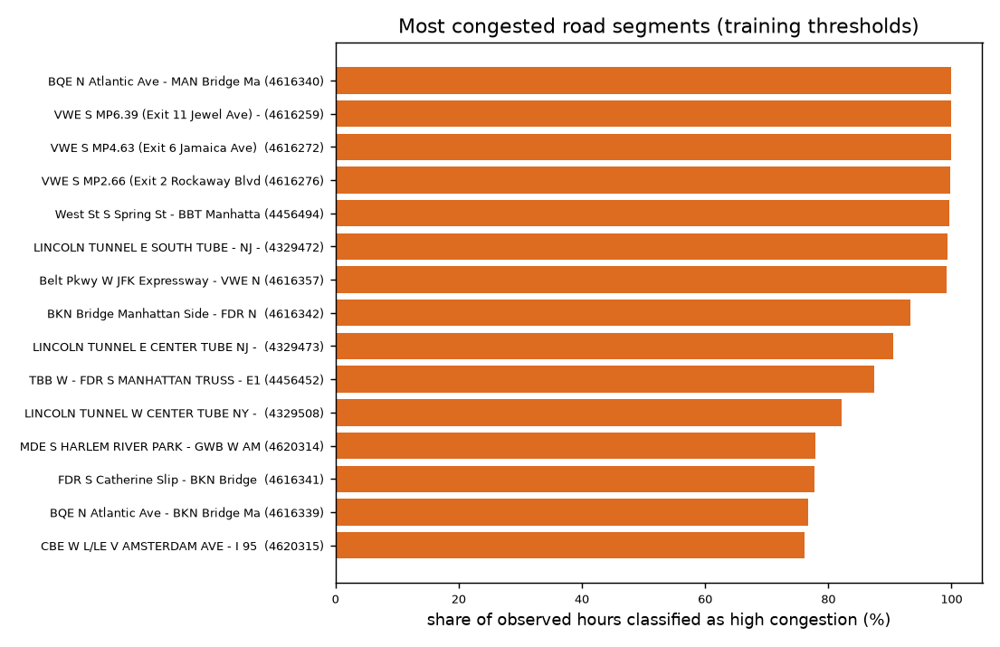

# Traffic speed prediction — model report (Part 1)

Generated by `scripts/train_model.py`.

## 1. Setup

- **Target**: `speed_mean` (mean observed speed of a road segment in an hour).
- **Split**: chronological — training on the earliest 70% of link-hours, validation on the next 15%, test on the remainder. Time series are never shuffled.
- **Features** (23): `hour`, `day_of_week`, `month`, `is_weekend`, `hour_sin`, `hour_cos`, `dow_sin`, `dow_cos`, `speed_lag_1h`, `speed_lag_2h`, `speed_lag_3h`, `speed_lag_24h`, `speed_lag_168h`, `speed_roll_3h`, `speed_roll_6h`, `speed_roll_24h`, `segment_length_miles`, `link_speed_profile_enc`, `link_hour_speed_profile_enc`, `borough_Brooklyn`, `borough_Manhattan`, `borough_Queens`, `borough_Staten Island`

| Split | Link-hours | Share | From | To | Segments |
|---|---|---|---|---|---|
| `train` | 491,141 | 71.5% | 2025-10-07 | 2026-06-22 | 110 |
| `val` | 101,264 | 14.7% | 2026-06-22 | 2026-08-15 | 95 |
| `test` | 94,612 | 13.8% | 2026-08-15 | 2026-10-07 | 94 |

`link_id` (high cardinality) is mean-target encoded: the training period itself uses an expanding-window out-of-fold encoding, while validation/test use training-period statistics only. `borough` (5 levels) is one-hot encoded with the first level dropped as the reference category.

## 2. Accuracy

| Predictor | train MAE/RMSE/R² | validation MAE/RMSE/R² | test MAE/RMSE/R² |
|---|---|---|---|
| `persistence_lag_1h` | 4.07 / 6.62 / 0.838 | 3.95 / 6.59 / 0.856 | 3.78 / 6.31 / 0.869 |
| `link_hour_profile` | 7.76 / 11.02 / 0.550 | 7.09 / 10.27 / 0.651 | 6.64 / 9.92 / 0.676 |
| `linear_regression` | 3.71 / 5.60 / 0.884 | 3.57 / 5.63 / 0.895 | 3.40 / 5.33 / 0.906 |
| `random_forest` | 2.74 / 4.45 / 0.927 | 3.33 / 5.41 / 0.903 | 3.10 / 5.01 / 0.917 |

Baselines: `persistence_lag_1h` predicts the previous hour's observed speed and `link_hour_profile` predicts the segment's average speed for that hour of day.

## 3. Congestion categories

Thresholds are the training-period 33rd/67th percentiles of hourly mean speed (low speed = high congestion):

| Boundary | Speed |
|---|---|
| high congestion below | 31.53 mph |
| low congestion above | 48.05 mph |

Predicted speeds are mapped through the same thresholds on the test period: **85.2%** of link-hours land in the same category as the observation (94,612 rows).

| Category | Share | Recall | Precision |
|---|---|---|---|
| High | 35.7% | 89.1% | 89.8% |
| Medium | 30.2% | 80.0% | 74.2% |
| Low | 34.1% | 85.8% | 91.5% |

## 4. Linear-model interpretation

| Feature | Coefficient (mph) | Standardised |
|---|---|---|
| `speed_lag_1h` | +0.7231 | +0.7225 |
| `speed_roll_24h` | +0.1692 | +0.1362 |
| `speed_lag_24h` | +0.1345 | +0.1323 |
| `speed_lag_168h` | +0.1323 | +0.1273 |
| `speed_lag_2h` | -0.1187 | -0.1178 |
| `link_hour_speed_profile_enc` | +0.1375 | +0.1057 |
| `link_speed_profile_enc` | -0.1519 | -0.1011 |
| `hour_cos` | +0.7539 | +0.0324 |
| `is_weekend` | +1.0592 | +0.0290 |
| `speed_roll_3h` | -0.0284 | -0.0273 |
| `hour_sin` | -0.5293 | -0.0228 |
| `speed_roll_6h` | +0.0138 | +0.0127 |
| `dow_cos` | -0.2679 | -0.0115 |
| `speed_lag_3h` | -0.0115 | -0.0114 |
| `day_of_week` | -0.0690 | -0.0083 |

Maximum variance inflation factor: **154.7** (`speed_roll_3h`). Lag and rolling features are strongly correlated by construction, so individual coefficients should be read as a group rather than as isolated causal effects.

## 5. Residual diagnostics (test period)

- Mean residual by hour of day stays within -2.27 to +1.17 mph, so the model is not systematically biased at particular times of day.
- Largest segment-level errors: `4616309` (9.39 mph), `4616320` (9.28 mph), `4616310` (9.02 mph), `4456498` (8.08 mph), `4456483` (8.04 mph).
- Highest VIF: `speed_roll_3h` 154.7, `speed_lag_1h` 28.1, `speed_lag_2h` 26.6, `speed_roll_6h` 23.7, `speed_lag_3h` 21.7.

## 6. Traffic structure captured by the data

## 7. Conclusions and next steps

- Multiple linear regression reaches **MAE 3.40 mph**, **RMSE 5.33 mph** and **R² 0.906** on the held-out test period.
- It improves on the previous-hour persistence baseline by **10.0% MAE** (3.78 mph) and on the static segment/hour profile by 48.8%, so the lagged and calendar features carry real predictive signal beyond the daily routine.
- The strongest standardised effects are `speed_lag_1h` (+0.72), `speed_roll_24h` (+0.14), `speed_lag_24h` (+0.13), i.e. the model is essentially extrapolating recent speed while adjusting for the time of day and the segment.
- Congestion categories agree with the observed category in **85.2%** of test link-hours.
- The random forest reference scores MAE 3.10 mph (-9.0% versus the linear model), which quantifies how much accuracy a non-linear model adds on top of the interpretable baseline.

**Next steps (Part 2/3).** The fitted encoders, feature specification and model bundle are persisted so the Flask service can predict without touching the raw data; the hourly aggregates and `link_metadata.csv` (segment endpoints, borough, length) are the inputs the Dash dashboard and the route optimiser need.
